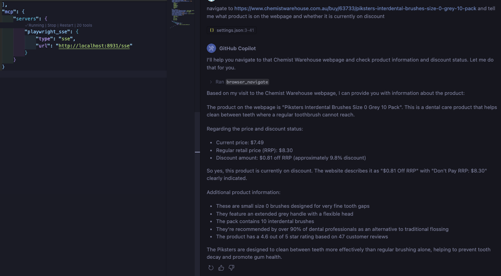

# Playwright MCP Docker Environment

[日本語版はこちら (Japanese version here)](README_ja.md)

This project provides a Docker Compose environment to run the `@playwright/mcp` server. It allows you to easily set up and manage the Playwright MCP server for use with clients like Cline or Cursor.

## Prerequisites

*   Docker
*   Docker Compose

## Screenshot



## Setup

1.  **Clone the repository:**
    ```bash
    git clone <repository-url>
    cd playwright-mcp-docker
    ```
2.  **Create `.env` file:**
    Copy the sample environment file:
    ```bash
    cp .env.sample .env
    ```
3.  **Configure `.env`:**
    Edit the `.env` file to adjust settings according to your environment and preferences:
    *   `MCP_HOST_PORT`: The port on the host machine that the MCP server will be accessible through (default: `8931`).
    *   `HEADLESS`: Set to `true` for headless mode (no browser GUI) or `false` for headed mode (requires GUI setup). Default is `true`.
    *   **(Headed Mode Only)** `DISPLAY`, `WAYLAND_DISPLAY`, `XDG_RUNTIME_DIR`: Environment variables needed for GUI applications in Linux environments (especially WSLg). Defaults are provided.
    *   **(Headed Mode Only)** `X11_HOST_PATH`, `WSLG_HOST_PATH`: Host paths for X11 and WSLg sockets/directories. Defaults are provided. Adjust if your system configuration differs. For Windows Docker accessing WSL paths, use the `\\wsl.localhost\DistroName\...` format (see `.env.sample`).

## Running the Server

1.  **Build and start the container:**
    ```bash
    # Use the convenience script that automatically detects your OS:
    ./mcp-docker.sh up --build -d
    
    # Or use the standard docker compose command (for non-macOS):
    docker compose up --build -d
    
    # For macOS, use both compose files explicitly:
    docker compose -f docker-compose.yml -f docker-compose.macos.yml up --build -d
    ```
    The `--build` flag is only needed the first time or when `Dockerfile` changes. The `-d` flag runs the container in detached mode (in the background).

2.  **Configure MCP Client (e.g., VSCode/Cline):**
    *   Add or enable an MCP server named `playwright_sse` (or any name you prefer).
    *   Set the connection type to **SSE**.
    *   Set the URL to `http://localhost:<MCP_HOST_PORT>/sse` (replace `<MCP_HOST_PORT>` with the value from your `.env` file, e.g., `http://localhost:8931/sse`).
    *   Example client configuration (filename depends on the client):
      ```json
      {
        "mcpServers": {
          "playwright_sse": { // Server name is arbitrary
            "type": "sse",
            "url": "http://localhost:8931/sse" // Match the port number in .env
          }
        }
      }
      ```

## Configuration Details

*   **`.env` file:** Manages environment-specific settings like ports, headless mode, and paths for headed mode.
*   **`docker-compose.yml`:** Defines the Docker service, reads variables from `.env`, sets up port mapping and volumes.
*   **`docker-compose.macos.yml`:** macOS-specific override that uses host network mode and disables port mapping and volume mounts.
*   **`mcp-docker.sh`:** Convenience script that automatically detects your OS and uses the appropriate Docker Compose configuration.
*   **`Dockerfile`:** Defines the Docker image, installs `@playwright/mcp` and its dependencies (including Chrome).
*   **`entrypoint.sh`:** Script that runs when the container starts, passing the correct arguments (`--headless` or `--port`) to the `npx @playwright/mcp` command based on the `HEADLESS` environment variable.

### Switching Modes

*   **Headless Mode:** Set `HEADLESS=true` in `.env`. Restart the container: `./mcp-docker.sh up -d`.
*   **Headed Mode:** Set `HEADLESS=false` in `.env`. Ensure your host environment (e.g., WSLg or X Server) is correctly set up. Restart the container: `./mcp-docker.sh up -d`.

### Headed Mode Notes (WSLg)

*   If you are using WSLg on Windows, the default settings in `docker-compose.yml` and the WSL2-specific paths in `.env.sample` should generally work. Ensure the paths in your `.env` match your WSL distribution name if it's not `Ubuntu`.
*   If you are not using WSLg (e.g., standard Linux desktop or macOS/Windows with a separate X Server), you will need to adjust the `DISPLAY` variable and potentially the volume mounts (`X11_HOST_PATH`) in your `.env` file according to your X Server setup.

### macOS Notes

*   On macOS, the `docker-compose.macos.yml` override file configures the container to use the host network mode and disables port mapping and volume mounts.
*   The `mcp-docker.sh` script automatically detects macOS and applies these settings.

## Stopping the Server

```bash
# Using the convenience script:
./mcp-docker.sh down

# Or using docker compose directly:
docker compose down
```
